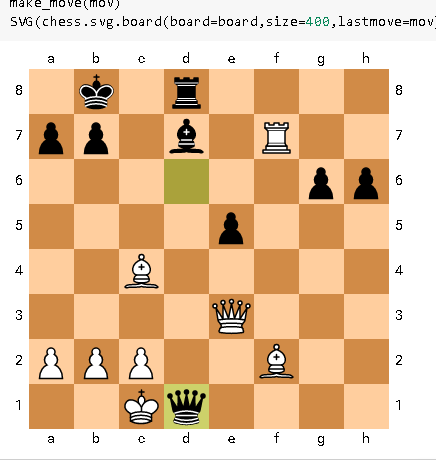

# Chess with python

start with :
`.\scripts\activate`

taken from here : <https://github.com/astoeckl/mediumchess>

Me , I just combined notebooks, the engine is pretty slow, though.

The engine solving :
