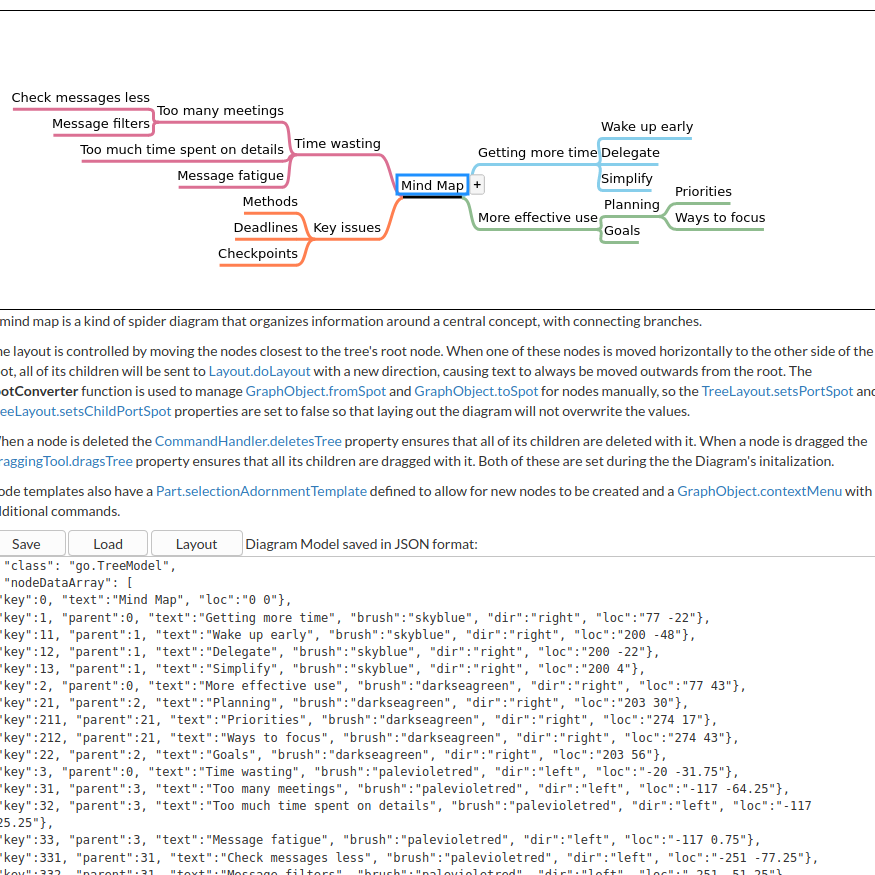

# EML_PARSER AND VISUALISATION IN GOJS

Reference for notes : https://codepen.io/soundwave7331/pen/xxVKbEr

GoJs mindmap : https://gojs.net/latest/samples/mindMap.html

> input_to_parser file directory will contain from and to

