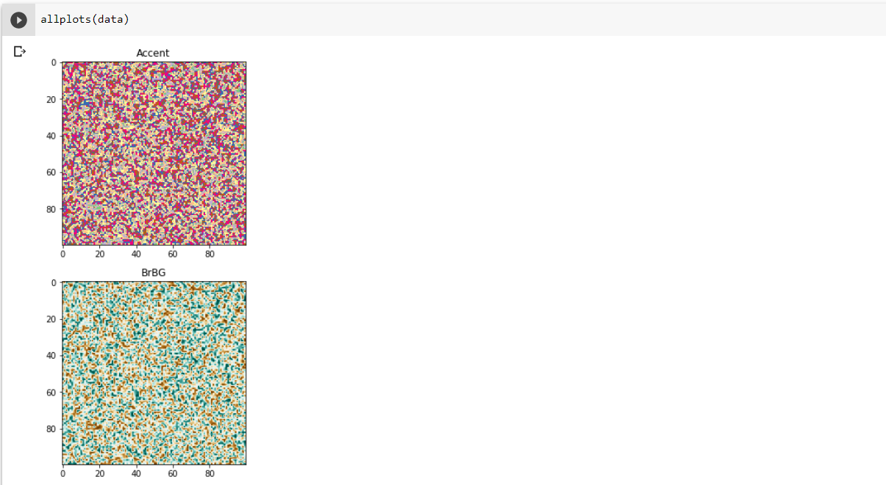

# Allplots

https://medium.com/analytics-vidhya/how-to-create-a-python-library-7d5aea80cc3f

python setup.py pytest

Now that all the content is there, we want to build our library. Make sure your present working directory is /path/to/mypythonlibrary (so the root folder of your project). In your command prompt, run:

> python setup.py bdist_wheel

Your wheel file is stored in the “dist” folder that is now created. You can install your library by using:

> pip install /path/to/wheelfile.whl