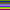
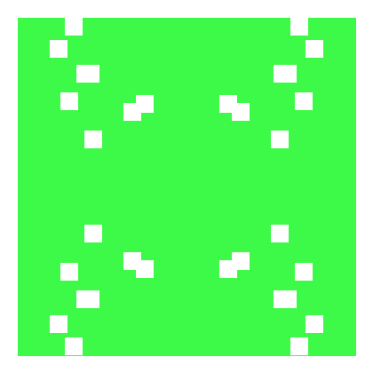

# Random color generator in python

`python random_strip_gen.py` will create a random image of 10 strips of 10 x 10 dimensions

To do :
1. customise the dimension :ballot_box_with_check:
2. randomize the pattern :ballot_box_with_check:

sample -   (yes ! thats a randomly generated icon.)

`python gavatar.py` will create a random github like 420x420 icon/
sample - 

