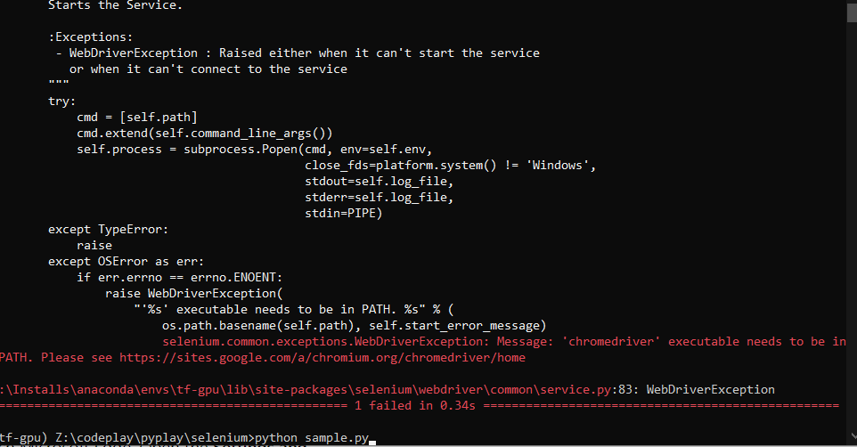

# Using selenium for 

`https://www.indiannavy.nic.in/npo/login/individual`

Guide from https://www.lambdatest.com/blog/selenium-webdriver-with-python/

for edge : https://www.tutorialandexample.com/selenium-web-driver-microsoft-edge-browser/#:~:text=Selenium%20WebDriver-%20Microsoft%20Edge%20Browser%201%20Open%20the,home%20page.%20...%208%20Close%20the%20browser.

Other error: 
 selenium.common.exceptions.WebDriverException: Message: 'Application' executable may have wrong permissions. Please see https://sites.google.com/a/chromium.org/chromedriver/home

 TO run :  `pytest sample.py --verbose --capture=no`

 If you get webdriver exception it has to do with driver

 

 So it is not working in brave browser need to try chrome

 
