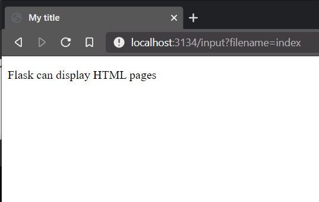

# creating a tracert visualiser in python

Requirements:

1. IPWhois
2. flask

## Installing a simple flask server

Adding leaflet

helpful codepen : https://codepen.io/gislayer/pen/KBwMK

## Final files

1. sample_geojson.html
2. tracert_flask.py

## Todo 

try and find the ip for the other entries in a tweet